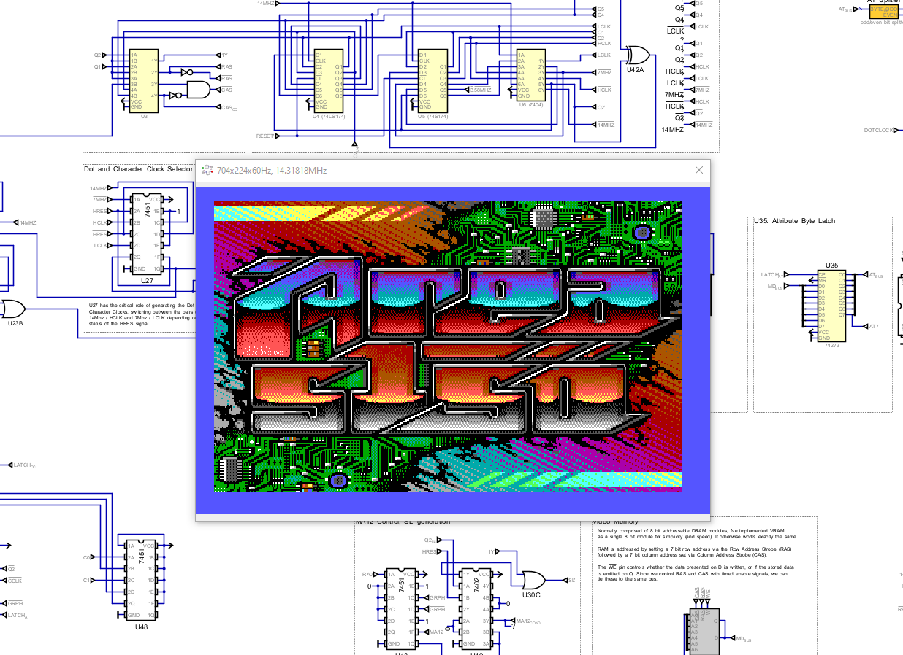

# simcga

This is a digital logic simulation of the IBM CGA card, for the excellent [Digital](https://github.com/hneemann/Digital) digital logic simulator by Helmut Neemann. 

# Why?

I wanted to study the CGA card to better understand its operation and the operation of undefined mode flag combinations. It was also a good exercise to learn Verilog.

# Limitations

 - The CPU-side interface is not implemented. You have to manually load data into VRAM and toggle the bits you want in the mode control and color control registers.
 - The simulation comes with the splash screen for the incredible PC demo [Area 5150](https://www.pouet.net/prod.php?which=91938) loaded into VRAM and light blue in the CC register like the demo sets it.

# Important Note

Digital has a "VGA" output component, although the built-in timings are not compatible with CGA so I had to patch Digital to add support for CGA.
You can find the relevant changes in this branch of my fork of Digital [here](https://github.com/dbalsom/Digital_videomod/tree/cga-video-modes).

Please don't ask me how to build it. I've never built Digital, I just patched the JAR. The fork is provided for GPL3 compliance. 

# How to Use

## Portable Windows Install 

Head over to [releases](https://github.com/dbalsom/cga_sim/releases) and grab one of the portable install builds for Windows. It bundles OpenJDK, Icarus Verilog and Digital for you -- just run `run_cga_sim.bat`.

## Installing Manually

### Install Prerequisites

 - Java of some sort. I'd recommend OpenJDK. There's a million ways to install this, so I will trust you can Google the best way for your platform.
 - Install or build [Icarus Verilog](https://github.com/steveicarus/iverilog) on your system.
 - Install the [v0.31 release of Digital](https://github.com/hneemann/Digital/releases/tag/v0.31). Download the `Digital.jar` file included in the [release zip](https://github.com/dbalsom/cga_sim/releases/tag/v0.1) and copy it over the `Digital.jar` in the installation.

 - Run Digital, and go to Edit -> Settings. 
   - Click on the Advanced tab.
   - Click on the browse button (...) by the `IVerilog` text box, and locate the `iverilog` binary, wherever you installed it.

### Running the simulation
  - The main simulation file will be named `cga_NN.dig` where NN is the current version. Open it via File -> Open.
  - Press the play button in the toolbar to start the simulation. It may take a minute for the simulation to produce a frame. 
    - A window will pop up when the simulator has acquired sync lock on the output signal. You may need to resize this window to see the entire output. 

  - The CRTC is initialized for Area 5150's "ANSI from hell" mode to show the demo's splash screen. There are few mode presets in the `mc6845_10.v` file you can edit if you say, want regula r 80x25 text mode. Just edit the `STARTUP_MODE` variable at the top of the file and save.  Digital should pick up the changes the next time you start the simulation.

  - You can load video memory with different things. 
    - Locate the MCM4517 component in the "Video Memory" box at bottom-center. 
    - Right click on the MCM4517 and click *open*.
    - Right click on the 'EEPROM' component and click *Edit*.
    - Go to File, Load, and select a new VRAM dump. The file should be a 16KB binary. Note: CGA VRAM organization may not be what you expect - odd bytes from the CPU perspective are offset by 4096. 
      - You can format linear dumps of CGA VRAM to the CGA's internal format using the provided [cga_swizzle](./vram/cga_swizzle.py) script.
      - Some ready-made VRAM images are supplied in [vram](vram/).

Note that if you want to change the overscan color you will need to set a new color in the Color Control register directly to the right of the CRTC. 
There is a CGA palette reference at the top of the diagram. 

# Special Thanks

- *Helmut Neemann* of course for making the kickass [Digital](https://github.com/hneemann) simulator.
- *Stephen Williams* for making [Icarus Verilog](https://github.com/steveicarus/iverilog).
- *hkz* for redrawing all the [CGA schematics in KiCad](https://github.com/hkzlab/CGA_Schematics) which was very helpful.
- *Trixter*, *reenigne*, *VilerR*, *PCRetroTech* and the rest of the crew
- *John Elliott* for his excellent [CGA Notes](https://www.seasip.info/VintagePC/cga.html)

# Licenses

[Digital](https://github.com/hneemann/Digital) is licensed under the GPL3 license.
Source for all modifications is available [here](https://github.com/dbalsom/Digital_videomod/tree/cga-video-modes).

[Icarus Verilog](https://github.com/steveicarus/iverilog) is licensed under the GPL2 license.